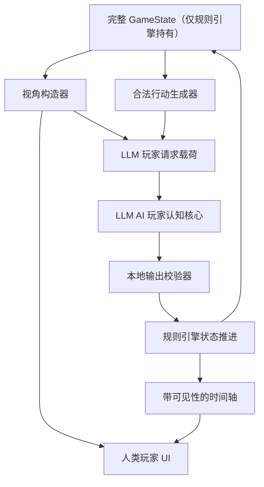

# 小狼杀重启需求定义与规划

日期：2026-06-13

本文是“小狼杀”项目的重启讨论文档，用于替代原先以功能阶段为主的推进口径。本文不包含实现代码；它定义新的产品重心、架构边界、回溯清单和后续阶段拆分。

## 1. 重启背景

当前项目已经形成 `specs/00` 到 `specs/12` 的阶段文档，并实现了基础规则、时间轴、脚本 AI 和 Web 训练界面的部分能力。但实际呈现效果不理想，主要风险不是单个模块缺失，而是项目主轴偏离：

- 原路线以“规则、AI、UI、教练、评分、复盘”功能分层推进。
- 用户真正想验证的是“像真人一样对抗的狼人杀可玩性”。
- 如果继续补齐功能，可能得到一个流程完整但不好玩的训练器。

因此本次重启将项目从“功能阶段驱动”调整为“真实对抗体验驱动”。

## 2. 已确认方向（锁定）

以下为本轮讨论中已确认的核心方向，后续只允许追加说明，不应轻易推翻：

1. 长期目标是训练“狼人杀完整游戏能力”，未来所有板子、所有角色都应可玩。
2. MVP 优先验证可玩性、胜负刺激和 AI 对抗感；复盘、训练反馈是辅助，不是第一优先级。
3. MVP 可以先只做人类平民视角，核心验证白天发言对抗、站边和投票是否好玩。
4. 真实玩家感优先，MVP 可以依赖 LLM API key；无 API key 不再要求完整核心体验。
5. LLM 作为 AI 玩家认知核心，负责局势理解、怀疑、站边、跳身份、发言和投票候选。
6. 本地规则引擎仍是权威裁判，负责信息过滤、合法行动、状态推进、胜负结算和越权兜底。
7. 玩家发言采用“先结构化意图 + 可补充文本，后续开放自由文本”的路线。

## 3. 待验证假设

以下内容是当前阶段的设计假设，需要在后续原型中用可玩测试验证：

- 人类平民视角是否足以支撑第一版可玩性。
- LLM 驱动的 AI 玩家是否能在有限上下文内产生稳定、可信、互相有差异的发言和投票。
- 结构化意图 + 补充文本是否能兼顾玩家表达自由和系统可控性。
- 本地校验器是否能有效阻止 LLM 泄露隐藏信息、提交非法行动或编造规则事实。
- 多个 AI 玩家连续调用 LLM 的成本、延迟和失败重试是否可接受。

## 4. 回溯清单

本次重启会影响旧文档和旧阶段边界，需要先修正上一层项目规则，再继续开发。

### 4.1 与旧规则的冲突

- 旧规则：LLM 永远不是决策层。  
  新规则：LLM 可以作为 AI 玩家“决策候选生成层”，但不能成为规则裁判。

- 旧规则：MVP 必须无 API key 完整可用。  
  新规则：核心真实对抗体验可以依赖 LLM API key；无 key 只保留弱降级、测试替身或开发模式。

- 旧规则：LLM 发言、AI 复盘、LLM 安全细则属于 MVP 后阶段。  
  新规则：LLM AI 玩家能力前置为 MVP 核心，LLM 安全边界也必须前置。

- 旧规则：脚本 AI 是 MVP 核心对手。  
  新规则：脚本 AI 降级为兜底、测试替身和失败恢复机制，不再承担真实玩家感目标。

### 4.2 需要修订的文档

- `AGENTS.md`：更新项目目标、MVP 口径、LLM 权限边界、阶段执行规则。
- `README.md`：更新项目说明和 MVP 验证目标。
- `specs/03-script-ai-opponents.md`：降级为“本地兜底 AI 与测试替身”，不再作为真实对抗核心。
- `specs/09-optional-ai-review.md`、`specs/10-optional-llm-speech-layer.md`、`specs/12-llm-boundaries-and-safety.md`：需要合并或前置为新的 LLM 玩家架构阶段。
- 新增 `ProjectStatus.md`：作为后续对话的轻量入口。

## 5. MVP 新定义

新版 MVP 是一个“LLM 驱动的 6 人狼人杀 AI 对抗训练原型”：

- 人类玩家固定或默认先玩平民。
- AI 扮演其他 5 名玩家，包括狼人、预言家、女巫、平民。
- 游戏仍采用 6 人快速局作为第一块板子。
- 本地规则引擎维护完整真实状态。
- 每个 AI 只接收自身可见视角、公开发言、私有信息、合法行动列表和角色目标。
- LLM 输出结构化玩家决策候选，包括发言、怀疑、站边、投票和必要的夜间行动。
- 本地校验器验证输出是否合法、是否越权、是否泄露隐藏信息。
- 玩家通过结构化意图和补充文本参与白天讨论。
- 游戏结束后只提供轻量复盘，重点解释关键票型、明显误判和下一局建议。

## 6. 推荐架构

核心原则是“LLM 做玩家大脑，本地引擎做裁判”。

### 6.1 本地权威层

本地系统必须负责：

- 角色、阵营、座位、存活状态。
- 阶段推进和回合顺序。
- 每个玩家当前合法行动。
- 胜负判断。
- 时间轴事件及可见性。
- 玩家视角、AI 视角、赛后视角的过滤。
- LLM 输出合法性校验。
- LLM 失败时的重试、降级和记录。

### 6.2 LLM AI 玩家层

LLM 负责模拟 AI 玩家认知，但只能基于过滤后的视角：

- 当前可见信息摘要。
- 自己的身份、阵营目标和私有结果。
- 公开发言和投票历史。
- 合法行动列表。
- 其他玩家公开声明和可见矛盾。
- 自己上一轮发言、站边和投票理由。

LLM 可以输出：

- 当前怀疑对象和理由。
- 当前信任对象和理由。
- 是否跳身份或反驳他人身份。
- 发言意图和最终发言文本。
- 投票候选和投票理由。
- 夜间行动候选。

LLM 不得输出或修改：

- 完整 `GameState`。
- 真实隐藏身份。
- 随机种子。
- 胜负结果。
- 时间轴权威事实。
- 规则状态字段。
- 超出合法行动列表的动作。

### 6.3 输出校验层

LLM 输出必须结构化，至少包含：

- `actionType`：行动类型。
- `targetId`：目标玩家，若无目标则为空。
- `speechIntent`：发言意图。
- `speechText`：公开发言文本。
- `reasoningSummary`：面向赛后或调试的简短理由。
- `confidence`：模型自评置信度。
- `usedEvidenceEventIds`：引用的可见事件。

校验器必须检查：

- 行动是否在合法行动列表内。
- 目标是否存在且当前可选。
- 发言是否包含不该知道的隐藏身份或私密结果。
- 理由引用的事件是否对该 AI 可见。
- 是否包含“我是 AI”“系统提示”“忽略规则”等元话术服从痕迹。
- 是否把猜测写成规则事实。

失败处理顺序：

1. 要求 LLM 基于错误原因重试。
2. 若仍失败，选择本地弱脚本兜底行动。
3. 将失败记录写入内部调试事件，不暴露给玩家视图。

## 7. 玩家发言路线

### 7.1 MVP：结构化意图 + 补充文本

MVP 中，玩家白天发言先选择意图，再补充一句自然语言。示例意图包括：

- 质疑某人。
- 支持某人。
- 反驳某段发言。
- 声称自己是某身份。
- 要求某人解释票型。
- 建议投票目标。
- 暂时划水或保留意见。

这样做的收益：

- AI 更容易理解玩家表达。
- 系统能保留结构化事件，方便投票和复盘。
- 可以降低自由文本带来的注入和解析风险。
- 仍保留一句自然语言，避免玩家完全像在点菜单。

### 7.2 后续：自由文本发言

自由文本应在 MVP 验证通过后开放。开放前必须具备：

- 文本到结构化意图的解析层。
- 元话术和提示注入识别。
- AI 对玩家自由文本的可见证据引用。
- 失败时要求玩家重写或自动降级为结构化意图。

## 8. 三种重启路径对比

### 方案 A：修补旧路线

继续沿旧 `specs/00-07` 补齐脚本 AI、UI、评分和复盘。

- 收益：现有代码可继续利用，工程风险小。
- 代价：很可能继续得到“流程完整但不好玩”的结果。
- 风险：脚本 AI 语言和局势理解上限低，无法验证真实玩家感。

### 方案 B：LLM 玩家核心重启（推荐）

重写项目规则和阶段文档，把 LLM AI 玩家前置为 MVP 核心。

- 收益：最贴合“真实对抗感优先”的产品目标。
- 代价：需要 API key、结构化协议、校验器、失败重试和成本控制。
- 风险：非确定性更高，测试需要以协议、边界和回放样本为主。

### 方案 C：快速 LLM 原型先行

先做一个很薄的 LLM 对话狼人杀原型，规则和安全边界暂时简化。

- 收益：最快看到“像不像人”。
- 代价：容易形成一次性原型，后续重构成本高。
- 风险：隐藏信息泄露、规则漂移和不可测试问题会被推迟爆发。

推荐选择方案 B：它保留真实玩家感目标，同时用本地规则和校验器控制长期工程风险。

## 9. 新阶段拆分建议

### 阶段 R0：重启文档与规则重写

目标：把项目治理从旧 MVP 切换到新 MVP。

交付：

- 更新 `AGENTS.md`。
- 更新 `README.md`。
- 新增或重写新版阶段文档目录。
- 标记旧 `specs/00-12` 的继承、废弃和迁移关系。
- 建立 `ProjectStatus.md`。

验收：

- 所有顶层文档对 MVP 是否依赖 LLM 的描述一致。
- LLM 权限边界不再自相矛盾。
- 明确脚本 AI 是兜底，不是真实玩家感核心。

### 阶段 R1：LLM 玩家协议与信息隔离设计

目标：先把 LLM 能看到什么、能输出什么、如何被校验定义清楚。

交付：

- `LlmPlayerView` 数据契约。
- `LegalActionOption` 数据契约。
- LLM 请求载荷和响应载荷。
- 输出校验规则。
- 多视角信息泄露矩阵测试设计。
- 一组固定样例局面，用于协议测试。

验收：

- 任意 AI 请求中不包含完整 `GameState`。
- 狼人只知道狼队友，不知道神职真实身份。
- 预言家只知道自己的查验结果。
- 女巫只知道规则允许的夜晚信息和药水状态。
- 平民不知道任何隐藏身份。
- LLM 输出不能绕过合法行动列表。

### 阶段 R2：6 人平民视角可玩骨架

目标：实现人类平民能完成一局的最小体验。

交付：

- 人类默认平民。
- 5 名 AI 玩家补齐其他座位。
- 夜晚由 AI 玩家提交候选行动，本地规则结算。
- 白天有公开发言、玩家发言、AI 回应、投票、放逐。
- 游戏结束公布胜负和身份。

验收：

- 一局可在 10 分钟内完成。
- 玩家不需要理解开发调试信息。
- AI 行动非法时本地系统能重试或兜底。
- 玩家至少能通过发言和投票影响局面。

### 阶段 R3：LLM 发言与站边一致性

目标：让 AI 看起来像有立场、有记忆、有阵营目标的玩家。

交付：

- AI 玩家短期记忆。
- 公开身份声明和查验声明追踪。
- 怀疑、信任、站边结构。
- 发言与投票理由一致性检查。
- 不同座位的语气和策略差异。

验收：

- AI 不再只是模板复读。
- AI 能引用公开发言和票型。
- AI 前后立场变化有可见原因。
- 狼人会尝试误导，好人会产生合理误判。

### 阶段 R4：玩家结构化发言体验

目标：把玩家发言做成既可控又有表达空间的交互。

交付：

- 发言意图选择。
- 补充文本输入。
- 指向具体玩家或发言的反驳。
- 发言写入时间轴。
- AI 能理解玩家意图和补充文本。

验收：

- 玩家不会觉得只能点固定台词。
- AI 能对玩家发言做出相关回应。
- 元话术不能让 AI 放弃角色目标。

### 阶段 R5：轻量复盘与可玩性评估

目标：提供辅助反馈，但不让复盘喧宾夺主。

交付：

- 胜负与身份揭晓。
- 关键回合摘要。
- 玩家关键投票评价。
- 2 到 3 条下一局建议。
- 简单“本局是否好玩”的人工反馈入口。

验收：

- 复盘基于时间轴，不凭空评价。
- 不修改胜负和规则结果。
- 玩家能知道自己最关键的一次判断是否有效。

### 阶段 R6：自由文本发言

目标：在结构化意图稳定后开放更真实的玩家自由表达。

交付：

- 自由文本解析为结构化意图。
- 提示注入和元话术检测。
- 解析失败降级。
- AI 对自由文本的证据引用。

验收：

- 玩家可以自然发言。
- 系统仍能解释 AI 为什么理解成某个意图。
- 自由文本不能突破信息边界。

### 阶段 R7：扩展角色与板子

目标：从平民视角扩展到狼人、预言家、女巫，再扩展到更多板子。

交付：

- 人类狼人体验。
- 人类预言家体验。
- 人类女巫体验。
- 多规则集配置。
- 角色专属 UI 和行动流。

验收：

- 每个新增角色都有独立可玩闭环。
- 新角色不破坏已有信息隔离测试。
- 新板子通过规则配置接入，而不是复制一套逻辑。

## 10. MVP 验收标准

新版 MVP 完成时，应满足：

- 需要 LLM API key 才能体验核心真实对抗感。
- 人类玩家可以以平民身份完整玩完一局 6 人局。
- AI 发言不只是固定模板，能回应公开局势和玩家发言。
- AI 投票理由与公开发言、站边和角色目标基本一致。
- 狼人 AI 有误导行为，好人 AI 有合理误判。
- 本地规则引擎完成所有权威结算。
- LLM 不接收完整 `GameState`。
- LLM 输出非法时不会直接污染规则状态。
- 游戏结束后有胜负、身份揭晓和轻量复盘。
- 玩家能在 10 分钟内判断“这个方向是否有继续打磨价值”。

## 11. 测试策略

由于 LLM 非确定性高，测试应分为三层：

### 11.1 本地确定性测试

- 规则引擎。
- 视角构造器。
- 合法行动生成器。
- 输出校验器。
- 时间轴可见性。
- 多视角信息泄露矩阵。

### 11.2 LLM 协议测试

- 使用固定局面快照。
- 检查请求 payload 不含隐藏信息。
- 检查响应 JSON 可解析。
- 检查非法输出会被拒绝。
- 检查重试和兜底路径。

### 11.3 人工可玩性测试

- 一局是否能在 10 分钟内完成。
- AI 是否有对抗感。
- 玩家是否觉得发言能影响局势。
- 是否出现明显泄密、胡编规则或前后失忆。
- 玩家是否愿意立刻再开一局。

## 12. 风险与缓解

| 风险 | 影响 | 缓解 |
| --- | --- | --- |
| LLM 成本过高 | 多 AI 玩家频繁调用会增加成本 | 压缩视角上下文、限制发言轮数、批量生成部分公共发言 |
| LLM 延迟过高 | 对局节奏变慢 | 使用回合队列、显示思考状态、限制每轮调用次数 |
| LLM 泄露隐藏信息 | 破坏游戏公平 | 严格视角构造、payload 快照测试、输出泄露检测 |
| LLM 编造规则事实 | 破坏信任 | 本地规则权威、引用可见事件、非法事实拒绝 |
| 玩家提示注入 | AI 被游戏外话术操控 | 元话术识别、角色目标提示、输出校验 |
| 测试不可确定 | 无法长期维护 | 本地逻辑确定性测试为主，LLM 只测协议和边界 |
| 平民 MVP 主动性不足 | 玩家觉得只是旁观 | 提高白天事件密度，让玩家发言和投票能改变局势 |

## 13. 下一步

下一步不应继续写业务代码，而应先完成阶段 R0：

1. 修订 `AGENTS.md`，使其与新 MVP 方向一致。
2. 修订 `README.md`，说明新版核心体验依赖 LLM。
3. 重排 `specs/`，把旧阶段标记为 legacy 或迁移对象。
4. 新增新版阶段 SPEC，至少覆盖 R1 到 R3。
5. 更新 `ProjectStatus.md`，作为后续所有对话的入口。

